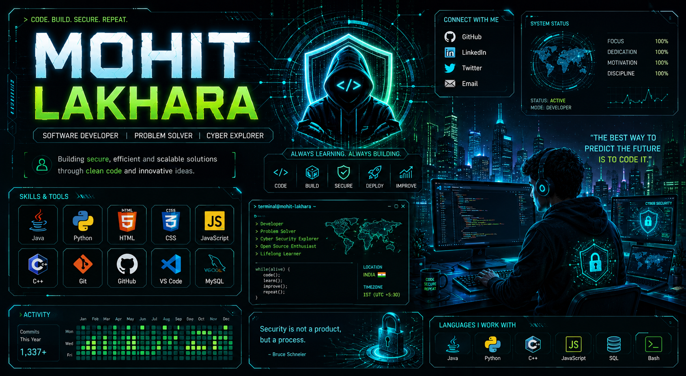

<h1 align="center">
  
</h1>

---

# Hi 👋, I'm Mohit G. Lakhara

### 💻 Software Developer | ☕ Java Developer | 🚀 DSA Enthusiast

---

## 🌐 Socials:
  

---

# 💻 Tech Stack:
           

---

---
# 📊 GitHub Stats:
 
 

---
<h2>📜 Certifications</h2>

<table>
  <thead>
    <tr>
      <th>Certificate</th>
      <th>Issued By</th>
      <th>Date</th>
    </tr>
  </thead>
  <tbody>
    <tr>
      <td>JavaScript</td>
      <td>Pearson VUE</td>
      <td>April 2025</td>
    </tr>
    <tr>
      <td>Python</td>
      <td>IBMCE</td>
      <td>September 2025</td>
    </tr>
    <tr>
      <td>Networking</td>
      <td>Cisco Certifications</td>
      <td>April 2026</td>
    </tr>
    <tr>
      <td>Cryptography and Network Security</td>
      <td>Indian Institute of Technology Kharagpur</td>
      <td>May 2026</td>
    </tr>
  </tbody>
</table>

---
<h2>🎓 Education</h2>

<table>
  <tr>
    <th>Qualification</th>
    <th>Board / University</th>
    <th>Duration</th>
    <th>Status</th>
  </tr>
  <tr>
    <td><b>B.Tech – Computer Science & Engineering (Cyber Security)</b></td>
    <td>Parul University</td>
    <td>2024 – 2028 (Expected)</td>
    <td>🟢 Pursuing</td>
  </tr>
  <tr>
    <td><b>Higher Secondary (Class XII)</b></td>
    <td>GSHSEB</td>
    <td>2023-2024</td>
    <td>✅ Completed</td>
  </tr>
  <tr>
    <td><b>Secondary (Class X)</b></td>
    <td>GSHSEB</td>
    <td>2021-2022</td>
    <td>✅ Completed</td>
  </tr>
</table>

---
### ✍️ Random Dev Quote

---
### 🔝 Top Contributed Repo

---

